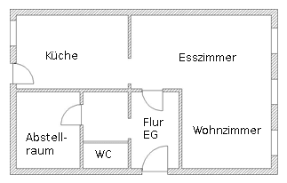
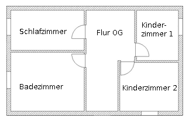
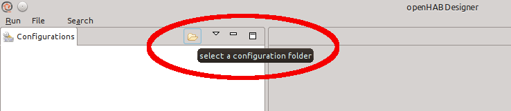
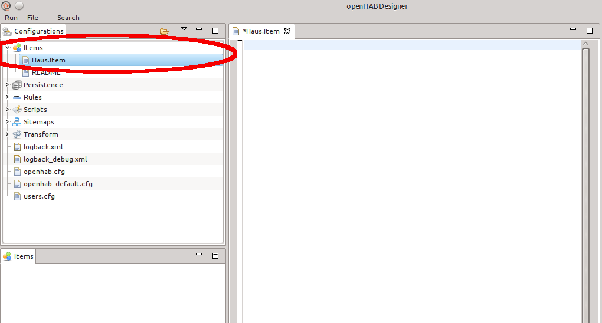
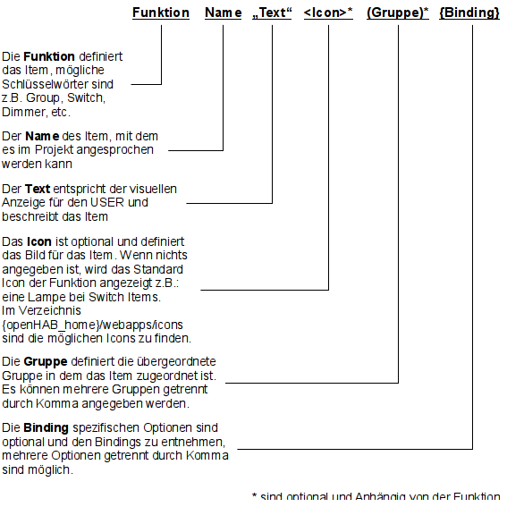
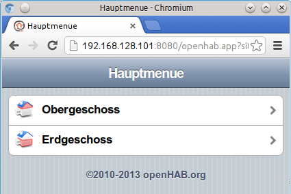
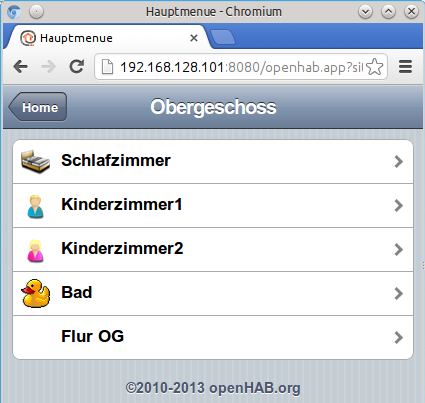
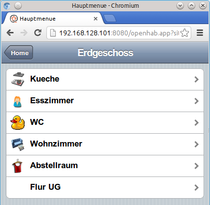

Erste Schritte mit openHAB
==========================

Um die Funktionsweise von openHAB kennenzulernen wird im folgenden ein
kleines Beispiel erstellt und stückweise erweitert. Für das Beispiel
wird eine Gebäudestruktur eines Einfamilienhauses verwendet, das aus
zwei Stockwerken und 12 Räumen besteht [siehe Abbildung [Grundriss]].
Mit Hilfe der Gebäudestruktur wird im folgenden der Aufbau von Items,
Gruppen und der Sitemap veranschaulicht.\
Im Beispielhaus befindet sich in jedem Raum mindestens 1 KNX-Schalter,
die Leuchten werden entweder über KNX-Schaltaktoren oder KNX-Dimmer
angesteuert. Erst im Kapitel [sec:AnbindungKNX] wird auf die KNX
Anbindung eingegangen und ist für das folgende Beispiel nicht relevant.

In openHAB werden die Objekte zum Schalten oder Dimmen Items genannt und
in der Datei *.items definiert. Zudem können Items in Gruppen
zusammengefasst werden.

Beispiel: Visualisierung Haus
-----------------------------

Vor Beginn muss die Item-Datei, Sitemap-Datei und openHAB
Konfigurationsdatei openhab.cfg angelegt werden. Beim ersten Start des
openHAB Designer muss dieser ebenfalls einrichten werden.

Als erstes wird mit Hilfe eines gewöhnlichen Texteditors die Item-Datei
im Verzeichnis \<Pfad\_zu\_openHAB\>/configurations/items angelegt. In
unserem Beispiel nennen wir diese Haus.items. In ihr werden zukünftig
alle benötigen Items und Gruppen definiert.\

* * * * *

Beim Anlegen der Datei Haus.items darauf achten, dass die
Dateierweiterung nicht .txt ist! Bei inkorrekter Dateierweiterung kann
es zu Fehlern bei openHab bzw. beim openHab-Designer kommen.

* * * * *

Im Verzeichnis \<Pfad\_zu\_openHAB\>/configurations muss eine kopie der
Datei openhab\_default.cfg angelegt und in openhab.cfg umbenennen
werden. Ohne diese Datei gibt openHAB eine Fehlermeldung aus! Die
Einstellungen dieser Datei sind aktuell noch nicht relevant. Details
hierzu werden in Kapitel [sec:AnbindungKNX] erläutert. Der Designer kann
nun gestartet werden. Je nach Betriebssystem und Rechenleistung kann
dies einige Zeit dauern. Nach erfolgreichem Start, muss dem Designer der
Pfad zum Verzeichnis „configurations“ von openHAB mitgeteilt werden
(siehe Abbildung [Designer~C~onfig]). Hierzu das Ordner Symbol drücken
und anschließend im angezeigten Dialog das Verzeichnis auswählen in dem
sich die openhab.cfg Datei befindet und mit OK bestätigen. In unserem
Fall ist dies \<Pfad\_zu\_openHAB\>/configrurations.

Danach sollte wie in Abbildung  der Reiter
„configurations“ dargestellt werden. Die Vorbereitungen sind nun
abgeschlossen und es kann mit dem Beispiel begonnen werden.

Im Designer öffnen wir wie in Abbildung [Designer~I~tem] zu sehen ist
mit einem doppelklick der linken Maustaste die Datei Haus.items. Die
aktuell noch leere Datei erscheint nun in der Mitte des Designer. Nun
können wir mit dem Anlegen der Gruppen und Items beginnen. Eine Gruppen
Item Definition ist in openHAB wie folgt aufgebaut:

[Befehlsreferenz~I~tem]

In unserer Visualisierung sollen die Räume in das Erd- bzw. Obergeschoss
gegliedert werden. Hierzu legen wir die Gruppe gEG und gOG an und tragen
folgendes in die Item.datei ein:   

Code muss noch eingefügt werde!    

Die beiden Gruppen bestehen aus dem Schlüsselwort Group und ihrem Namen.
Mehr wird hierfür aktuell nicht benötigt. Die Abbilding
[Befehlsreferenz~I~tem] zeigt den prinzipiellen Aufbau eines Item.\

Wie in Programmiersprachen auch, kennt openHAB Kommentare. Diese können
durch // für eine Zeile bzw. für mehrere Zeilen durch /\* am Anfang und
\*/ am Ende eingeleitet werden. Die Kommentare werden in den
Code-Baispielen dieses Buch grün dargestellt.

Nun müssen noch die Räume definieren werden. Zuvor wird für jeden Raum
eine Gruppe definieren, in dem die eigentlichen Items (Schalter,
Sensoren und Aktoren) zugeordnet werden.
Die Item-Datei erweitern wir mit folgendem Code:

Mit Hilfe des Codes und der Abbildung [Befehlsreferenz~I~tem] sollte der
Aufbau verständlich werden.
Items bestehen immer aus den Komponenten Funktion, Name, Text und Icon.

Zum Schluss werden noch die eingentlichen Funktionen der einzelnen
Räumen über Items definiert. Zu Beginn beschränken wir uns auf Schalter
und Dimmer und fügen folgendes in die Items-Datei ein:

Auch hier ist der Aufbau der Items gleich, sie bestehen bestehen aus den
Komponenten Funktion, Name, Text und Gruppe. In diesem Beispiel wurden
kein Icons angegeben, da bei bestimmten Items wie zum Beispiel Switch,
Dimmer und Rollershutter ein Standard-Icon verwendet wird. Möchte man
dieses Standard-Icon nicht, so kann auch ein eigenes Icon angegeben
werden.

Die komplette Item-Datei sollte nun wie folgt aussehen:

Damit das Beispiel noch lauffähig wird, benötigt openHAB noch die
Sitemap-Datei. In ihr wird der Aufbau des Weboberfläche definiert. Im
Ordner sitemaps wird eine Datei Haus.Sitemaps angelegt und folgendes
eingetragen.

Nachdem nun die drei wichtigsten Dateien angelegt wurden, kann das
Beispiel gestartet werden. Hierzu öffnen wir die Konsole (Linux) bzw.
die Dos-Box (Windows) und wechseln mit dem Befehl cd
\<Pfad\_zu\_openHAB\>/runtime (Linux) oder dir
\<Pfad\_zu\_openHAB\>\\runtime (Windows) in das Verzeichnis von openHAB.
Anschließend wird openHAB mit dem Befehl ./start.sh (Linux) bzw.
start.bat gestartet.\

Nach erfolgreichem Start öffnen wir einen Browser und geben folgendes
ein:   
http://localhost:8080/openhab.app?sitemap=Haus\#   
Bei manchen Browsern (z.B. Firefox) gibt es Probleme mit der Darstelung. Als Browser kann Chronium bzw. Chrome empfohlen werden.   
Das Ergebniss des Ersten Beispiel sieht wie folgt aus:

OpenHAB kann durch die Tastenkombination Strg+C beendet werden.

Erweiterung des Beispielhaus
============================

Im vorherigen [Beispiel](#Beispiel--Visualisierung-Haus) wurden die Items Switch und Dimmer sowie der Grundlegende Aufbau von Gruppen erläutert. Nun soll das Beispiel um weitere Items und Gruppen ergänzt werden.

Contact Item
------------
Mit hilfe des Contact-Item können die Zustände offen und geschlossen angezeigt werden, vorzugsweise für Fenster- oder Türkontakte.

Im Beispiel ergänzen wir nun in der Items-Datei Haus.items um folgene Zeilen um z.B. den Status des Küchenfenster sowie der Haustür abzufragen. 

Code und Bild müssen noch eingefügt werden!