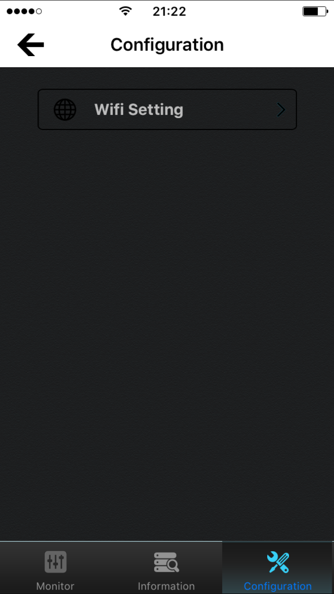
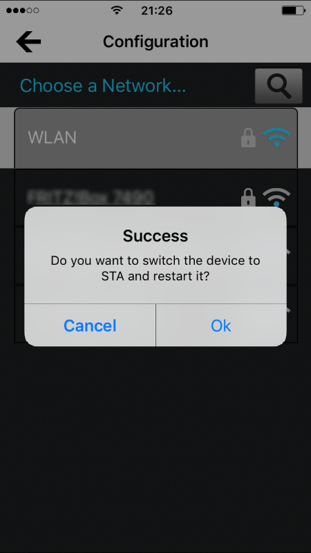
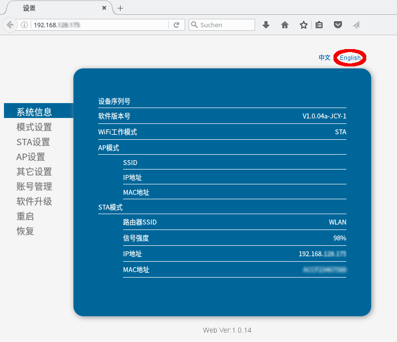
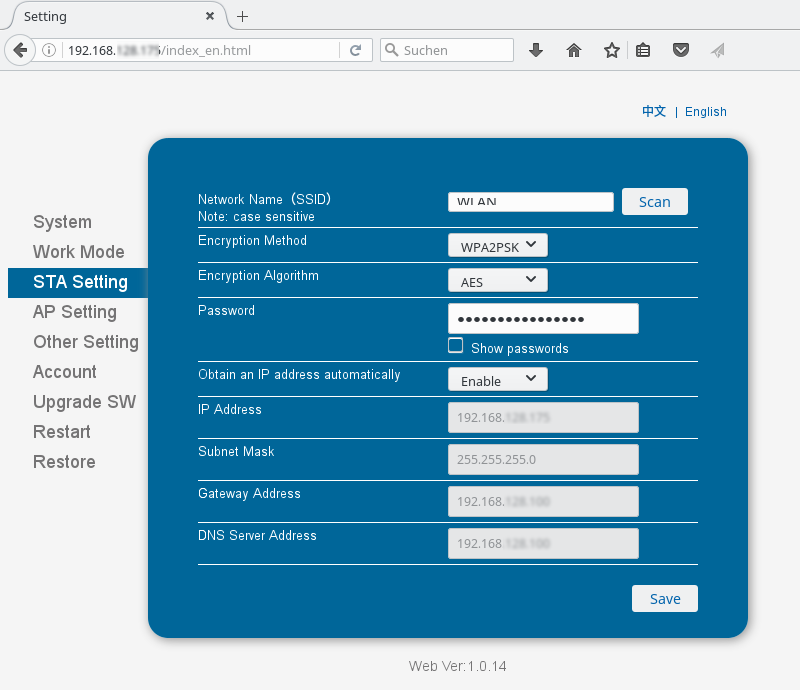
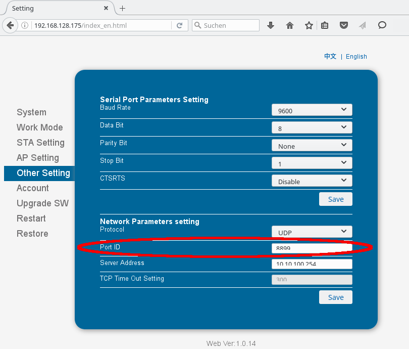

Milight Binding
===============

Das Mi-Light Binding ist wie alle Bindings als Modul im Zip-File Addons enthalten.
Um mit openHAB die Mi-Light Leuchtmittel zu steuern muss das milight Binding in das Verzeichnis
<Pfad_zu_openHAB>/addons kopiert und die openHAB Konfiguration angepasst werden. Im Folgenden wird dies detailliert erklärt.

Inbetriebnahme des Mi-Light Bundles
----------------------------------

Das vorliegenden Mi-Light Bundle besteht aus 4 RGB Leuchtmittel mit GU10 Fassung und einem Mi-Light WLAN Controller.
Die beigefügte Anleitung ist leider nur auf Englisch und sehr knapp gehalten. Der Aufbau der ersten Verbindung war nur mit Hilfe einer Recherche im Internet möglich.  
Der Mi-Light WLAN Controller wird über einen Mini-USB Stecker mit 5V versorgt, beim Bundle liegt kein Netzteil bei.

1. Smartphone App aus App-Store herunterladen

2. Mi-Light WLAN Controller mit Spannung versorgen, die LED *SYS* blinkt. Der Mi-Light WLAN Controller arbeitet in den Werkseinstellungen als Access-Point
   Ein Werksreset kann durchgeführt werden, in dem der Reset Knopf 10 Sekunden lang gedrückt wird bis die beiden LEDs *Link* und *SYS* blinken.

3. Mit dem Smart Phone nach dem WLAN Netz *milight* suchen und verbinden. Wird das WLAN *milight* nicht gefunden, muss ein Werksreset durchgeführt werden.

4. App starten und die Systemkonfiguration durchführen (Einbindung in eigenes WLAN).  
   
   Nach erfolgreicher Einbindung in das eigene WLAN erfolgt eine Bestätigung die mit OK bestätigt werden muss.
   
   Der Mi-Light Controller startet neu. Das WLAN *milight* steht nun nicht mehr zur Verfügung, es muss ins eigene WLAN gewechselt werden.

5. Um das Leuchtmittel mit dem WLAN Controller zu verbinden, müssen diese eingebaut, ein und ausgeschaltet werden. Nach erneutem einschalten muss innerhalb von 3 Sekunden der (un)link Knopf betätigt werden. ist die Paarung erfolgreich, blinkt die Lampe 3 mal.

6. Die Lampe kann nun über die App gesteuert werden. 

Milight Binding Konfigurieren
-----------------------------

Der Mi-Light Controller verfügt über Web-Interface mit dem weitere Einstellungen möglich sind, wie zum Beispie die Vergabe einer festen Netzwerkadresse.
Um in das Web-Interface zu gelangen, müssen sie die aktuelle IP Adresse des Mi-Light Controllers kennen. Starten sie den Browser und geben dort die IP-Adresse des Mi-Light Controllers ein. Das Passwort und der USER sind *admin*.  

Beim Start des Web-Interface ist die Sprache noch cinesisch, dies kann aber rechts oben umgestellt werden (englisch)

Nun kann für openHAB die IP-Adresse fest eingestellt werden:  

Der erste Schrit um das Milight Binding zu Konfigurieren und in Betrieb zu nehmen, ist die Konfigurationsdatei anzupassen.  

    ################################ Milight Binding #################################
    
    # Host of the first Milight bridge to control 
    # milight:<MilightId1>.host=
    # Port of the bridge to control (optional, defaults to 50000)
    # milight:<MilightId1>.port=
    #
    # Host of the second Milight bridge to control 
    # milight:<MilightId2>.host=
    # Port of the bridge to control (optional, defaults to 50000)
    # milight:<MilightId2>.port=
    

* In der Zeile *milight:<MilightId1>.host* tragen sie die IP-Adresse des Mi-Light Controllers ein.  
* Die Zeile *milight:<MilightId1>.port* entspricht dem Port über den openHAB mit dem Mi-Light Controller kommuniziert. Der Wert ist optional, sollte aber im Web-Interface der Mi-Light Controllers verifiziert werden, da ab Version V3.0 des Mi-light Controllers der Wert 8899 verwendet werden muss.

Wie die Item und Sitemap Datei zu Konfigurieren sind, kann der Beschreibung des Binding entnommen werden.