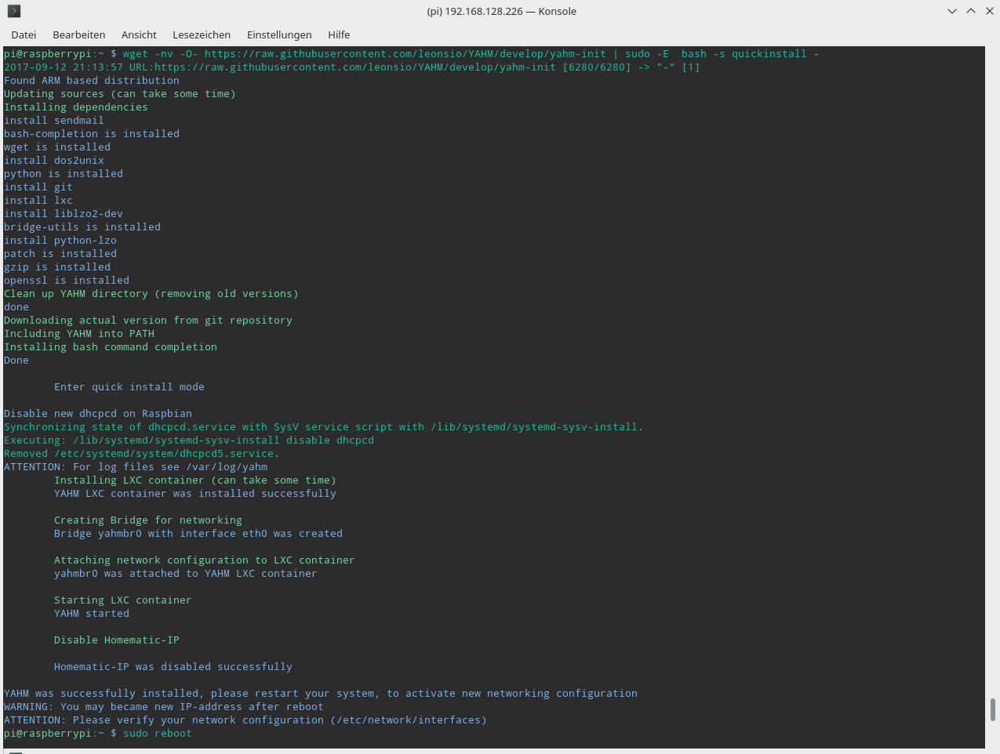
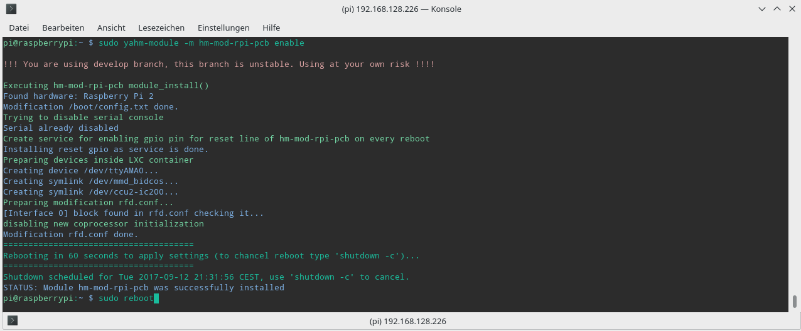

HomeMatic Binding in Verbindung mit YAHM
========================================

In diesem Kapitel wird die Einbindung von [HomeMatic](http://www.homematic.com/ "HomeMatic Homepage") in Kombination mit [YAHM](https://github.com/leonsio/YAHM "YAHM Homepage") und dem [HM MOD RPI PCB Raspberry Funkmodul](https://www.elv.de/homematic-funkmodul-fuer-raspberry-pi-bausatz.html) erläutert.
Sowohl openHAB als auch YAHM laufen dabei auf der gleichen Raspberry PI Hardware.  

Quelle zur Installation von YAHM ist das [YAHM Wiki](https://github.com/leonsio/YAHM/wiki) und der [Thread im homematic-forum.de](https://homematic-forum.de/forum/viewtopic.php?f=67&t=38472&sid=f6efd460f07b02a18780b51130d0ce55&start=130)

YAHM Installation
-----------------

Soll YAHM auf Raspbian Stretch installiert werden, muss mindestens das Imange vom September 2017 verwendet werden da es sonst Probleme bei der Installation gibt.
Die Installation ist sehr einfach und seit der neusten Version von YAHM (ab September 2017) muss bei Verwendung des HM-MOD-RPI-PCB Funkmodul nicht mehr Händisch in die Raspberry PI 2 oder Raspberry PI 3 Konfiguration eingegriffen werden.
Alles erfolgt völlig automatisch.  

Es wird davon ausgegangen, dass ein lauffähiger Raspberry vorliegt. Wie Raspbian auf dem Raspberry installiert wird ist einem früheren Kapitel zu entnehmen.

Vorgehensweise:  
1. Raspbery starten und anmelden bzw. Verbindung per SSH herstellen.  
2. Die Installation des YAHM Grundsystem incl. CCU2 Container.  
   `sudo wget -nv -O- https://raw.githubusercontent.com/leonsio/YAHM/develop/yahm-init | sudo -E bash -s quickinstall -`  
3. reboot durchgeführt und erneut anmelden  
   `sudo reboot`  

Nach erfolgreicher Installation und einem Reboot wird dem Raspberry PI eine zweit IP-Adresse zugewiesen mit der das HomeMatic WebUI (CCU2) erreicht werden kann.
Details zur Bedienung der HomeMatic WebUI bitte dem [Handbuch der WebUI](http://www.homematic.com/Downloads/eq3/download%20bereich/handbuecher/HomeMatic_WebUI_Handbuch_eQ-3.pdf) entnehmen.  

Damit Geräte im HomeMatic WebUI angelernt werden können, muss das HM-MOD-RPI-PCB Raspberry Funkmodul installiert werden.

	
Aktivierung des HM-MOD-RPI-PCB Funkmodul
----------------------------------------

1. Am Raspbery anmelden oder eine Verbindung per SSH herstellen.  
2. Raspberry PI herunterfahren.  
   `sudo shutdown now`  
   (bei einer Verbindung per SSH etwa 1 bis 2 Minute warten damit das System auch wirklich heruntergefahren ist)
3. Raspberry PI von der Spannungsversorgung trennen.  
4. Funkmodul aufstecken.  
5. Raspberry PI an die Versorgungsspannung anlegen, das System bootet selbststaendig.  
6. Nach erfolgreichem Start am System anmelden oder eine Verbindung via SSH herstellen.  
7. Aktivierung des Funkmodul  
   `sudo yahm-module -m hm-mod-rpi-pcb enable`  
8. reboot durchgeführt  
   `sudo reboot`  

Im HomeMatic WebUI ist das Funkmodul nun sichtbar und es können Geräte angelernt werden.
Werden HomeMatic IP Geräte verwendet, muss HomeMatic IP in YAHM erst aktiviert werden!  

Aktivierung von HomeMatic IP
----------------------------

Um HomeMatic IP Geräte verwenden zu können, muss dies explizit in YAHM aktiviert werden. Die Aktivierung kann mehrere Stunden dauern, da der Linux Kernel neu kompiliert werden muss.  

1. Am Raspbery anmelden oder eine Verbindung per SSH herstellen.  
2. Aktivierung von HomeMatic IP  
   `sudo yahm-module -m homematic-ip enable`  
	
Wie Homematic IP wieder deaktiviert werden kann, ist dem [YAHM Wiki](https://github.com/leonsio/YAHM/wiki) zu entnehmen.  

* * * * *
<tr>
<td>  </td>
<td> Achtung! Ist HomeMatic IP einmal aktiviert, funktioniert dieses bei einer Neuinstallation erst bei Aktivierung von HomeMatic IP wieder da es eine andere Firmware benutzt die vom Linux Kernel erkannt wird. [Siehe Thread im homematic-forum.de](https://homematic-forum.de/forum/viewtopic.php?f=67&t=38472&sid=f6efd460f07b02a18780b51130d0ce55&start=130#p383537) </td>
</tr>
</table>
* * * * *

HomeMatic in openHAB einrichten
-------------------------------
