HomeMatic Binding in Verbindung mit YAHM
========================================

In diesem Kapitel wird die Einbindung von [HomeMatic](http://www.homematic.com/ "HomeMatic Homepage") in Kombination mit [YAHM](https://github.com/leonsio/YAHM "YAHM Homepage") und dem [HM MOD RPI PCB Raspberry Funkmodul](https://www.elv.de/homematic-funkmodul-fuer-raspberry-pi-bausatz.html) erläutert.
Sowohl openHAB als auch YAHM laufen dabei auf der gleichen Raspberry PI Hardware.  

Quelle zur Installation von YAHM ist das [YAHM Wiki](https://github.com/leonsio/YAHM/wiki) und der [Thread im homematic-forum.de](https://homematic-forum.de/forum/viewtopic.php?f=67&t=38472&sid=f6efd460f07b02a18780b51130d0ce55&start=130)

YAHM Installation
-----------------

Soll YAHM auf Raspbian Stretch installiert werden, muss mindestens das Imange vom September 2017 verwendet werden da es sonst Probleme bei der Installation gibt.
Die Installation ist sehr einfach und seit der neusten Version von YAHM (ab September 2017) muss bei Verwendung des HM-MOD-RPI-PCB Funkmodul nicht mehr Händisch in die Raspberry PI 2 oder Raspberry PI 3 Konfiguration eingegriffen werden.
Alles erfolgt völlig automatisch.  

Es wird davon ausgegangen, dass ein lauffähiger Raspberry vorliegt. Wie Raspbian auf dem Raspberry installiert wird ist einem früheren Kapitel zu entnehmen.

Vorgehensweise:  
1. Raspbery starten und anmelden bzw. Verbindung per SSH herstellen.  
2. Die Installation des YAHM Grundsystem incl. CCU2 Container.  
   `sudo wget -nv -O- https://raw.githubusercontent.com/leonsio/YAHM/develop/yahm-init | sudo -E bash -s quickinstall -`  
3. reboot durchgeführt und erneut anmelden  
   `sudo reboot`  

Nach erfolgreicher Installation und einem Reboot wird dem Raspberry PI eine zweit IP-Adresse zugewiesen mit der das HomeMatic WebUI (CCU2) erreicht werden kann.
Details zur Bedienung der HomeMatic WebUI bitte dem [Handbuch der WebUI](http://www.homematic.com/Downloads/eq3/download%20bereich/handbuecher/HomeMatic_WebUI_Handbuch_eQ-3.pdf) entnehmen.  

Damit Geräte im HomeMatic WebUI angelernt werden können, muss das HM-MOD-RPI-PCB Raspberry Funkmodul installiert werden.

	
Aktivierung des HM-MOD-RPI-PCB Funkmodul
----------------------------------------

1. Am Raspbery anmelden oder eine Verbindung per SSH herstellen.  
2. Raspberry PI herunterfahren.  
   `sudo shutdown now`  
   (bei einer Verbindung per SSH etwa 1 bis 2 Minute warten damit das System auch wirklich heruntergefahren ist)
3. Raspberry PI von der Spannungsversorgung trennen.  
4. Funkmodul aufstecken.  
5. Raspberry PI an die Versorgungsspannung anlegen, das System bootet selbststaendig.  
6. Nach erfolgreichem Start am System anmelden oder eine Verbindung via SSH herstellen.  
7. Aktivierung des Funkmodul  
   `sudo yahm-module -m hm-mod-rpi-pcb enable`  
8. reboot durchgeführt  
   `sudo reboot`  

Im HomeMatic WebUI ist das Funkmodul nun sichtbar und es können Geräte angelernt werden.
Werden HomeMatic IP Geräte verwendet, muss HomeMatic IP in YAHM erst aktiviert werden!  

Aktivierung von HomeMatic IP
----------------------------

Um HomeMatic IP Geräte verwenden zu können, muss dies explizit in YAHM aktiviert werden. Die Aktivierung kann mehrere Stunden dauern, da der Linux Kernel neu kompiliert werden muss.  

1. Am Raspbery anmelden oder eine Verbindung per SSH herstellen.  
2. Aktivierung von HomeMatic IP  
   `sudo yahm-module -m homematic-ip enable`  
	
Wie Homematic IP wieder deaktiviert werden kann, ist dem [YAHM Wiki](https://github.com/leonsio/YAHM/wiki) zu entnehmen.  

* * * * *
<tr>
<td>  </td>
<td> Achtung! Ist HomeMatic IP einmal aktiviert, funktioniert dieses bei einer Neuinstallation erst bei Aktivierung von HomeMatic IP wieder da es eine andere Firmware benutzt die vom Linux Kernel erkannt wird. [Siehe Thread im homematic-forum.de](https://homematic-forum.de/forum/viewtopic.php?f=67&t=38472&sid=f6efd460f07b02a18780b51130d0ce55&start=130#p383537) </td>
</tr>
</table>
* * * * *

HomeMatic in openHAB einrichten
-------------------------------

Die nächsten Schritte erläutern die Installation und Konfiguration des openHAB2 HomeMatic Binding.
Eine Alternative Anleitung zum einrichten einer CCU unter openHAB2 ist [hier](http://onesmarthome.de/smart-home-openhab-2-homematic-ccu2-installation/) zu finden.

1. Via Browser die openHAB PaperUI aufrufen.__
   (<openHAB-IP> mit der IP-Adresse des Raspberry oder PC ersetzen)  
   `http://<openHAB-IP>:8080/start/index`

2. In der Auswahl links *Add-ons* und anschließend im Menü oben *Bindings* wählen.  
   Das *Homematic Binding* suchen und dies installieren.
   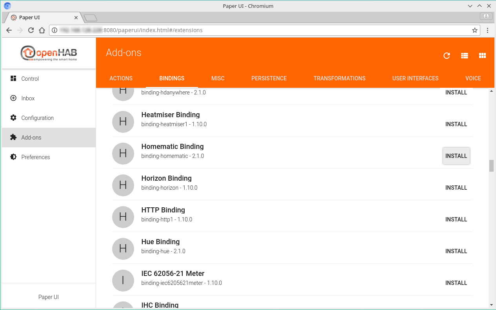

3. Wird YAHM verwendet, müssen die *Things* manuell angelegt werden. Hierzu in der Auswahl links *Search* und anschließend *Search THINGS* oder *+* wählen.
   

4. Anschließend wird eine Liste der installierten Bindings angezeigt. Um das *Thing* anzulegen, das Homematic Binding auswählen und anschließend weiter mit *MANUALLY ADD THING*  
   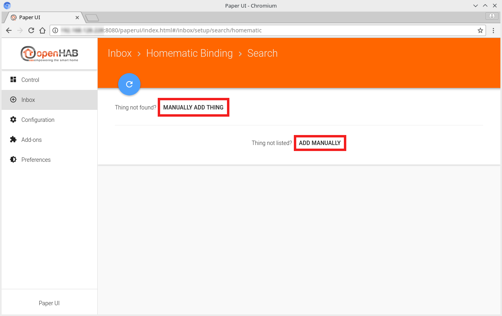

5. In der Liste *Homematic Bridge auswählen*  
   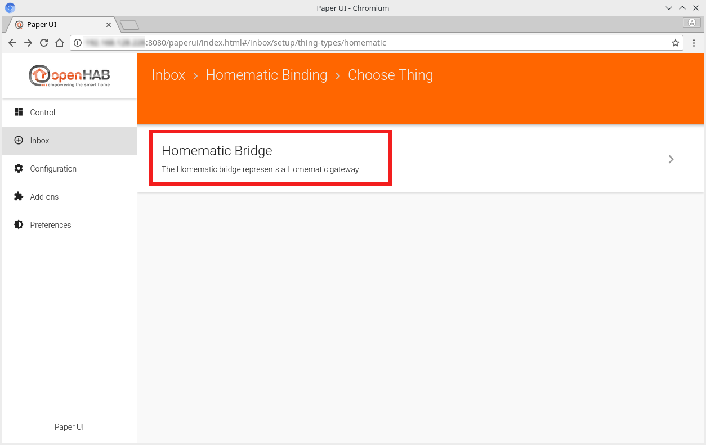

6. Um die Homematic Bridge zu konfigurieren, empfihlt es sich eine *Thing ID* z.B. ccu2 (1) zu vergeben. Im Feld *Gateway Addresse* (2) entspricht der IP der Homematic CCU2. Unter *Callback Network Address* (3) muss noch die IP-Adresse des openHAB 2 Server eingegeben werden. Um die Konfiguration abzuschließen, noch auf den blauen Haken (4) klicken.
   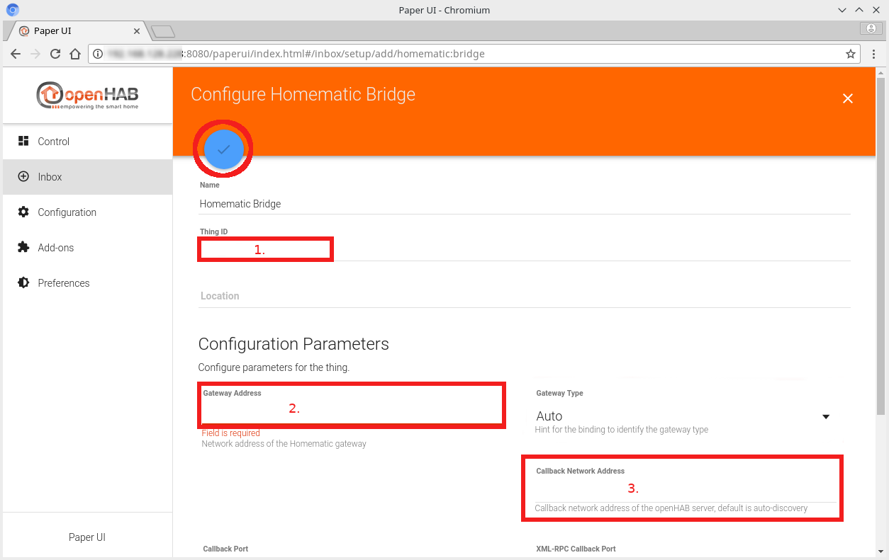

7. Wenn alles korrekt eingegeben wurde und openhAB die Bridge gefunden hat, wird die Homematic Bridge als online angezeigt (ggf. erst nach einem reboot). Zusätzlich werden neue *Things* in der *Inbox* angezeigt. Hierbei handelt es sich um zusätzliche Funktionen der CCU und die in der CCU angelernten Geräte.
   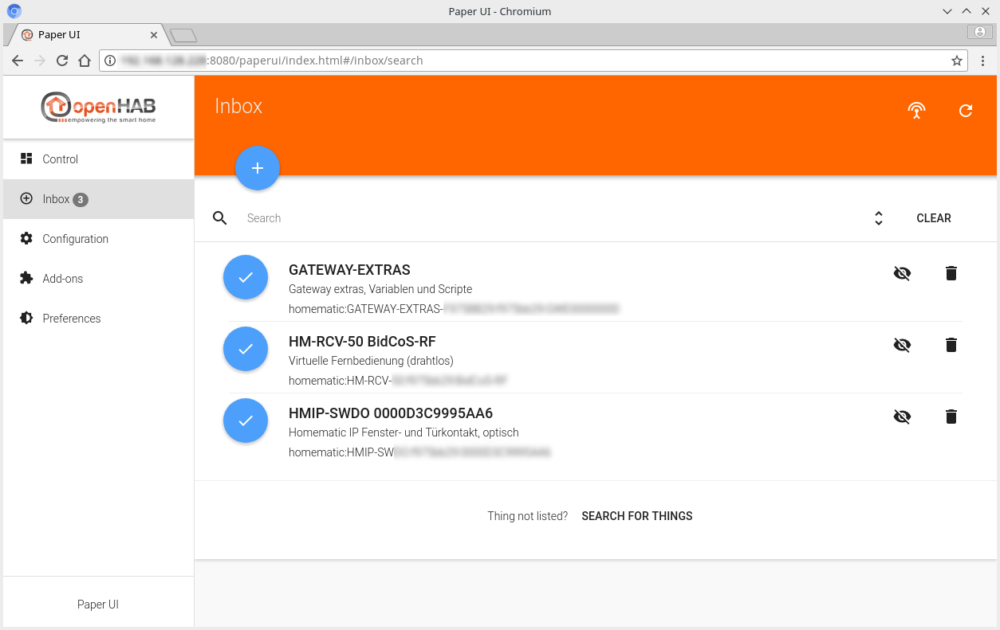
    
8. Zur Inbox wechseln und *GATEWAY-EXTRAS* hinzufügen  
     
   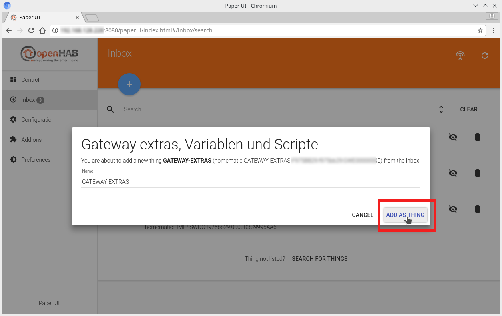  

9. *HM-RCV-50 BidCoS-RF* ebenfalls hinzufügen  
   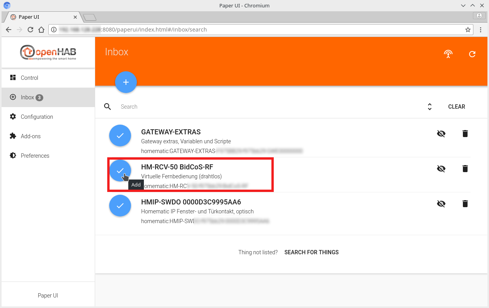  

HomeMatic Geräte in openHAB einbinden
-------------------------------------

Nach erfolgreicher Konfiguration des HomeMatic Gateway, können nun die Geräte wie am Beispiel eines Fensterkontakt eingerichtet werden.

1. Die in der Homematic Bridge ein gelernten Geräte werden in openHAB in der Inbox aufgelistet. Sollte dies nicht der Fall sein, einen Scann durchführen.
Im folgenden Beispiel wird ein Fensterkontakt aufgelistet.  
   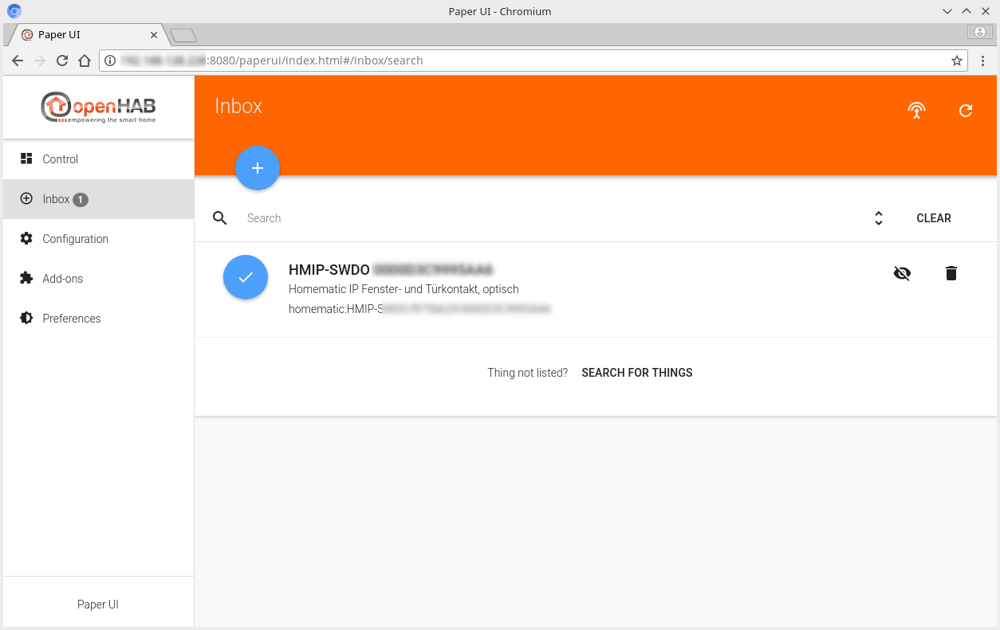  

2. Danach zu *Configuration* / *Items* wechseln um mit dem blauen Plus-Button ein neues Item hinzuzufügen.
   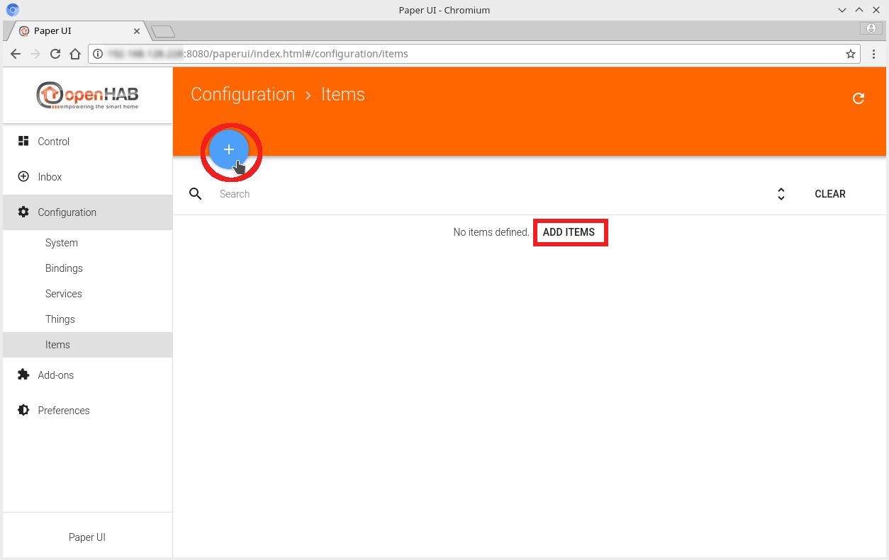  
   
3. Das Item entsprechend Konfigurieren z.B. siehe Bild. Die Konfiguration mit dem blauen Plus-Button abschließen.  
     

4. Zu *Configuration / Things* wechseln und dort den Fensterkontakt auswählen in dem z.B. der Text oder der große Runde Kreis mit dem H angeklickt wird  
   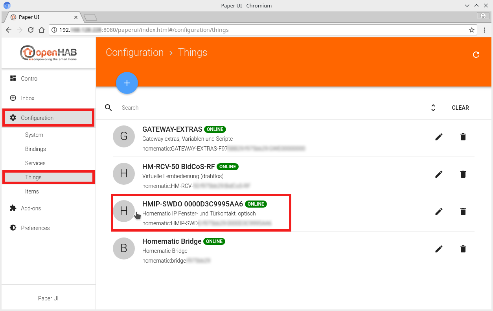  
   
5. Es werden nun die Channels des jeweiligen Thing angezeigt. In aktuellen Beispiel ist *State Contact* auszuwählen, da wir dieses mit einem *Contact Item* verknüpfen wollen.
   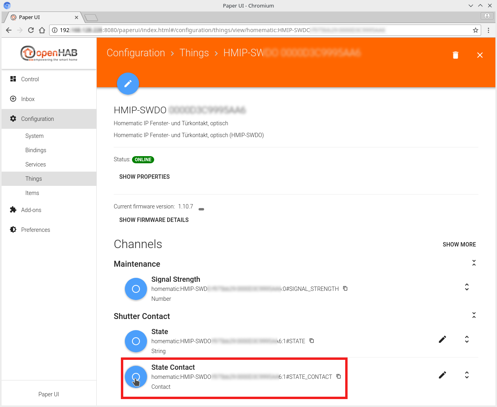  
   
6. Um den *Channel* *State Contact* mit dem Item von oben zu verknüpfen den Blauen Kreis anklicken und im folgenden Fenster das Item Auswählen und bestätigen.
     
Unter *Control* ist das *Item* nun sichtbar.

HomeMatic Geräte manuell in Item-Datei einbinden
-------------------------------------------------

Bei Verwendung der Classic- oder BasicUI muss die Item- und Sitemap-Datei manuell angelegt werden. Im folgenden wird erläuter wie ein Item Manuell angelegt wird und wie die Verknüpfung zum Homematic-Gerät hergestellt wird. 

In der openHAB Dokumentation zum [Homematic Bindng](http://docs.openhab.org/addons/bindings/homematic/readme.html#items) ist folgendermaßen beschrieben:  

Die Syntax zum Verknüpfen der Homematic Datenpunkte in der Itemm-Datei ist folgendermaßen aufgebaut:  

`homematic:TYPE:BRIDGE:SERIAL:CHANNELNUMBER#DATAPOINTNAME`

* homematic: Die ID des Homematic Binding, dieser Wert ist fix
* type: Art des Homematic Gerät
* bridge: Name / Bezeichnung der Homematic Bridge (CCU)
* serial: Seriennummer des Homematic Gerätes
* channelnumber: Kanal-Nummer des Homematic Datenpunkt
* datapointname: Name des Homematic Datenpunkt

Beispiel:

    Switch  RC_1  "Remote Control Button 1" { channel="homematic:HM-RC-19-B:ccu:KEQ0099999:1#PRESS_SHORT" }
    Dimmer  Light "Light [%d %%]"           { channel="homematic:HM-LC-Dim1T-Pl-2:ccu:JEQ0555555:1#LEVEL" }

* * * * *
<tr>
<td>  </td>
<td> Bei Homegear Geräten nicht den Präfix HG- vergessen! </td>
</tr>
</table>
* * * * *    

Im Homematic WebUI unter Einstellungen Geräte kann ein Teil der benötigten Parameter ausgelesen werden.  

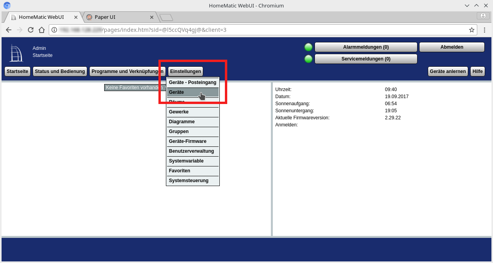  

In der Geräteübersicht kann die [1] Typenbezeichnung (type), [2] Seriennummer (serial) und der [3] Kanal (channelnumber) ausgelesen werden.  

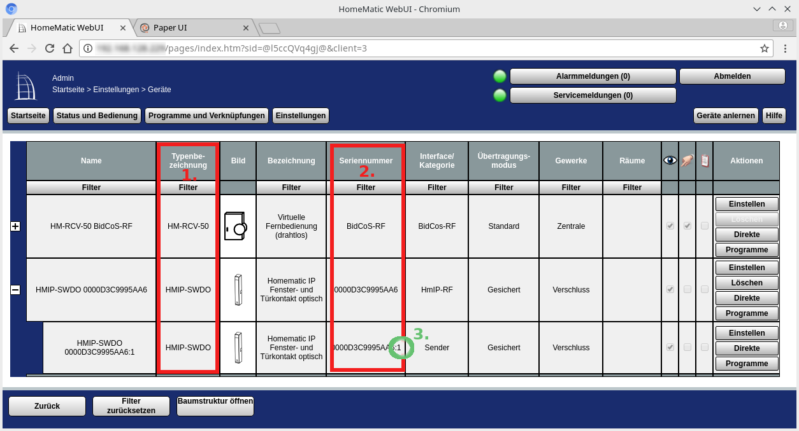  

Offen bleibt dadurch nur noch die Bezeichnung des Datenpunkt (datapointname)!  

Die einfachste Art die kompletten Syntax für die Item-datei zu bekommen ist, das jeweilige Gerät per PaperUI als *Thing* einzubinden um anschließend die komplette Syntax per copy&past zu erhalten (siehe Bild). In der Konfiguration des jeweiligen Gerätes, können die Channels angezeigt und der Syntax-String per Mausklick in die Zwischenablage kopiert werden.

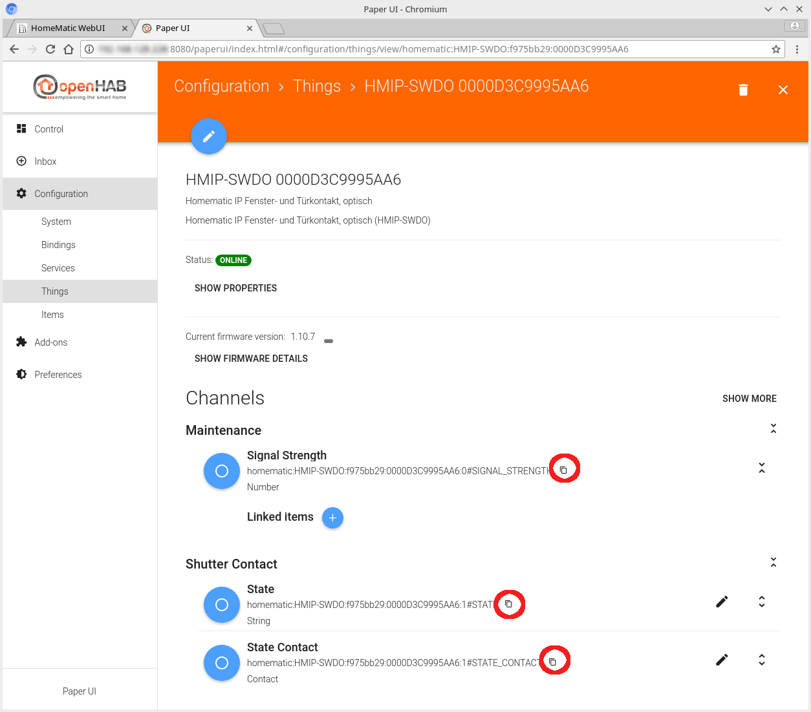  
