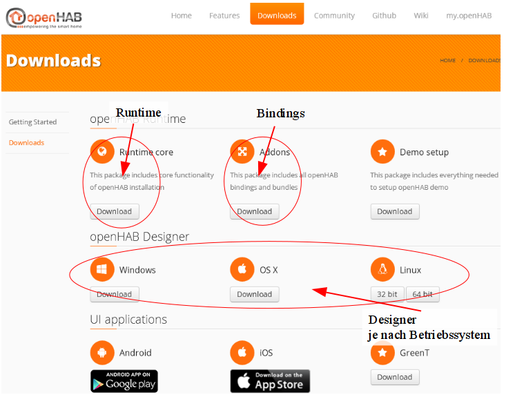

Installation auf PC
===================

OpenHAB ist ein in Java geschriebenes Programm, das auf jeden
Betriebssystem läuft, auf dem Java installiert ist.

OpenHAB Runtime
---------------

Die aktuelle Version kann von der Projektseite [openhab.org](http://www.openhab.org)
heruntergeladen und in einem beliebigen Ordner entpacken werden.   

z.B.:   
Linux:  /openhab/runtime   
Windows: E:\\openhab\\runtime\\   

Um die Schreibweise zu vereinheitlichen, wird in den folgenden Kapitel
das Verzeichnis mit \<Pfad\_zu\_openHAB\> ersetzt. Zum Ausführen von
openHAB, wechseln sie in das Verzeichnis \<Pfad\_zu\_openHAB\>. Abhängig
vom verwendeten Betriebssystem führen sie eines der beiden Scripte aus.   
Linux: start.sh   
Windows: start.bat   

BINDING/Addons herunterladen
----------------------------

Für die Kommunikation mit anderen Geräten oder Funktionen sind
sogenannten Bindings notwendig. So wird zum Beispiel für die
Kommunikation zu einem KNX-Gateway das KNX Bindings benötigt. Wie die
openHAB-Runtime, können auch die Bindings (Addons) von openhab.org
heruntergeladen und in einen beliebigen Ordner entpackt werden. Abhängig
davon mit welchen Geräten man kommunizieren möchte wird ein
entsprechendes Binding benötigt. Dieses wird in den Ordner
\<Pfad\_zu\_openHAB\>/addons kopiert. Nach einer evtl. Konfiguration des
Binding in der openHAB-Konfigurationsdatei openhab.cfg und einem
Neustart, steht dies zur Verfügung.

* * * * *

Einige Bindings erfordern eine Konfiguration in der
openHAB-Konfigurationsdatei openhab.cfg.

* * * * *

openHAB Designer
----------------

Es ist von Vorteil für die Arbeit mit openHAB den openHAB Designer zu
verwenden, da dieser Syntaxfehler erkennt und eine Autovervollständigung
implementiert hat. Der openHAB Designer kann auch von openHAB.org
heruntergeladen werden, dabei ist auf die Betriebssystem Version zu
achten. Nach dem Download den Designer in einem beliebigen Ordner
entpacken (z.B.: Linux:  /openHAB/designer).

