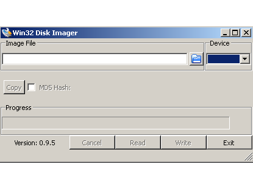
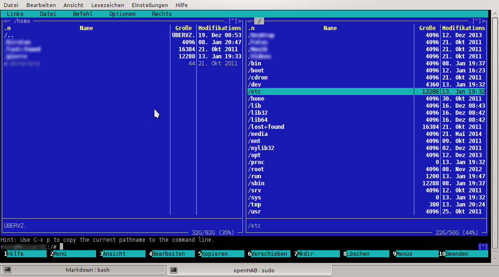
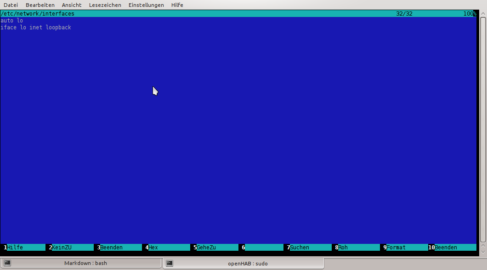
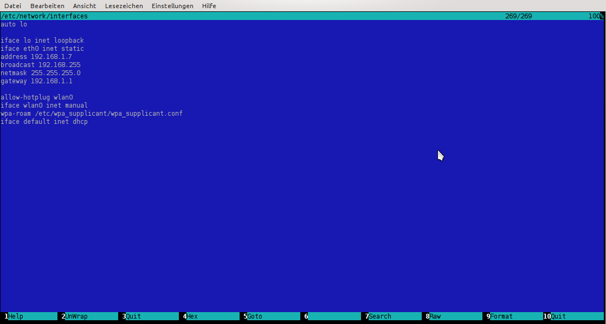
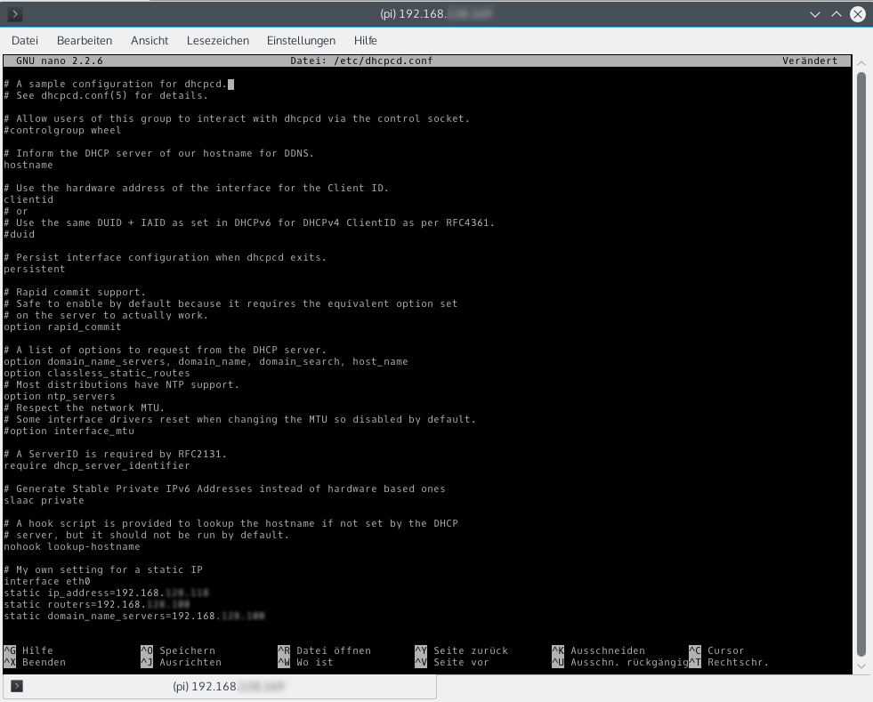
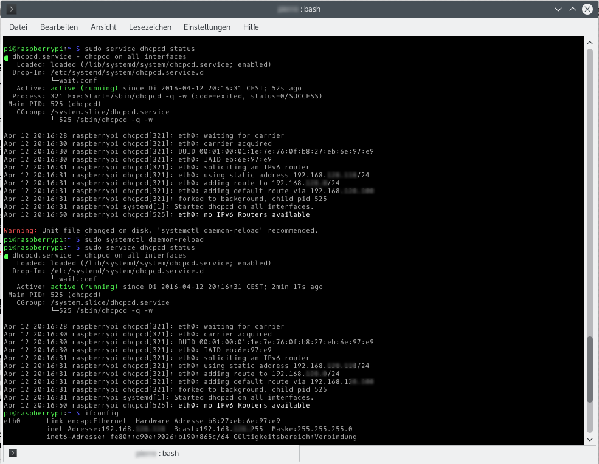
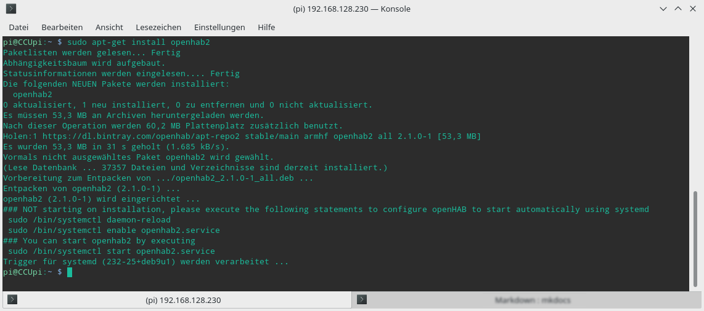
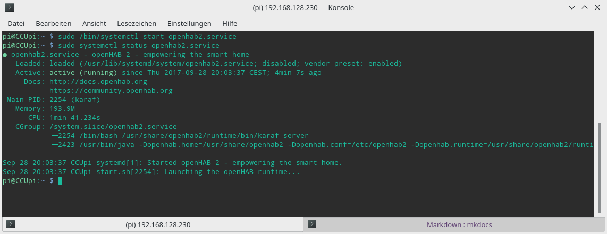
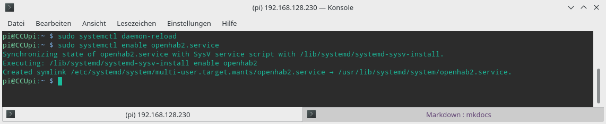

Linux und OpenHAB2 auf dem Raspberry PI einrichten
==================================================

In diesem Kapitel wird die Installation von [Raspbian](www.raspbian.org "Raspbian.org Homepage") und openHAB auf einem [Raspberry PI](http://www.raspberrypi.org/ "Raspberry PI Homepage") beschrieben.
Prinzipiell kann für die Nutzung von openHAB auf dem Raspberry PI auch andere Betriebssysteme verwendet werden. Im Folgenden beschränke ich mich auf die Linux Distribution _Raspbian_, das auf Debian Linux basiert und speziell für den Raspberry optimiert wurde. Der Name Raspbian setzt sich aus Raspberry und Debian zusammen. Die Nutzung eines Debian Derivat ermöglicht die Nutzung vieler Pakete (Programme) die für Debian bereitgestellt werden und mit [ubuntuusers.de](https://ubuntuusers.de/ "ubuntuusers.dee") steht eine großartige deutschsprachige Wiki bereit.

Raspbian installieren
---------------------

Das Raspbian Image kann entweder direkt von [raspberry.org](http://www.raspberrypi.org/downloads/) oder
[raspbian.org](http://raspbian.org/RaspbianImages) heruntergeladen werden. Alternativ kann für die
Installation von Raspbian oder andere Betriebssysteme auf dem Raspberry [NOOBS](http://www.raspberrypi.org/downloads/)
verwendet werden. Hierzu gibt es auf der Homepage raspberry.org
ausführliche [NOOBS-Installationsanleitungen](http://www.raspberrypi.org/help/noobs-setup/) und ein Video. Im
Handel gibt es SD Karte auf denen Raspbian oder NOOBS bereits vorinstalliert ist.
Dies erleichtert es für Anfänger, die sich nicht mit der Installation des Betriebssystems beschäftigen wollen.   
Im Folgenden wird die Installation des Raspbian-Images beschrieben. Für die initiale Installation empfiehlt es sich an den Raspberry einem Monitor oder TV sowie einer Tastatur und Maus anzuschließen.   

Materialien:  
- Raspberry PI incl. passendes USB-Netzteil mit einem mindest Ausgangsstrom von 1 A
- SD Speicherkarte mit mind. 4 GB Speicherplatz  
  (alternativ eine SD Karte mit vorinstalliertem Raspbian)
- TV oder Monitor mit HDMI Eingang
- HDMI Kabel
- USB Tastatur
- USB Maus (alternativ)
- PC mit Card Reader  
  (wird nur benötigt, wenn keine SD Karte mit vorinstalliertem Raspbian vorliegt)

Vorbereitung:  
Diese muss nur durchgeführt werden, wenn eine leere SD Karte vorliegt auf die das Raspbian-Image aufgespielt werden soll!

- Die aktuelle Raspbian Version von www.raspberrypi.org herunterladen und entpacken.
- Image auf SD Karte kopieren:
    - unter Windows:  
      Um das Raspbian-Image von einem Windows Betriebssystem auf die SD-Karte zu kopieren, kann das Programm
      [Win32DiskImager](http://sourceforge.net/projects/win32diskimager/files/) verwendet werden.  
        
      Nach Installation und Programmstart die SD-Karte und das Image auswählen, anschließend den Vorgang starten.
    - unter Linux:  
      Unter Linux kann das Programm dd verwendet werden. Das Programm dd ist bei den meisten Linux Distributionen bereits in der Grundinstallation enthalten. Um die Befehle ausführen zu können müssen die folgenden Befehle in einer Konsole ausgeführt werden.  
      Um dd verwenden zu können, muss zuerst der Gerätepfad (hier /dev/sdd) für die SD Karte ausfindig gemacht werden!
      1. `df -h` ausführen ohne gestekte SD Karte
      2. SD Karte in Lesegerät stecken
      3. `df -h` erneut ausführen die SD Karte sollte nun Beispielsweise wie folgt aufgelistet sein `/dev/mmcblk0pl` oder `/dev/sdd1`
      4. `dd bs=4M if=<Pfad zum Image>/2014-12-24-wheezy-raspbian.img of=/dev/sdd` kopiert das Image auf die SD Karte  
      In manchen Fällen ist das Aufspielen des Images mit dem Parameter bs=4M fehlerhaft, in diesem Fall das Ganze nochmals mit bs=1M testen.
- Nach dem Aufspielen des Image auf die SD-Karte, diese in den Raspberry einstecken und am TV oder Monitor sowie die Tastatur und Maus 
  anschließen. Beim ersten Start wird ein Konfigurationstool gestartet.  
  
  Sollte dies nicht der Fall sein, kann das Konfigurationstool mit folgenden Befehl gestartet werden:  
  ´sudo raspi-config´.
  Im Konfigurationstool folgende Punkte nacheinander durchführen:
  1. Advanced Options --> ssh (ggf. bei neueren Version nicht mehr Notwendig)
  2. Change User Password
  3. Internationalisation Options (Sprache und Tastaturlayout)
  4. Expand_Filesystems

- Nach dem Einrichten der wichtigsten Einstellungen die Konfiguration mit <Finish> abschließen.  
  Der Raspberry boote neu, sollte dies nicht der Fall sein, kann dies mit dem Befehl durchgeführt werden:  
  `sudo reboot -now`

- Nach einem Neustart kann man sich mit dem neu erstellten Passwort anmelden oder wenn dies nicht geändert wurde mit  
  USER: pi, Passwort:raspberry  
  Achtung: Zu beginn ist die Tastatur nicht auf deutsch eingestellt, wodurch y und z vertauscht sind!

Midnight Commander installieren (optional)
----------------------------------------

Für die komfortablere Navigation im Dateisystem sowie die Bearbeitung von Dateien ist es empfehlenswert das sehr hilfreiche
Programm ´mc´ zu installieren. Für die Installation von Midnight Commander, folgenden Befehl ausführen:  
´sudo apt-get install mc´  
Danach wird man aufgefordert, das root-Passwort
einzugeben, dies ist das gleiche wie für den user pi. Nach erfolgter Installation
kann das Programm mit dem dem Befehl ´mc´ (ohne root Rechte) oder ´sudo mc´ (mit root Rechte) ausgeführt werden.  


Statische IP-Adressen einrichten (optional)
-------------------------------------------

Standardmäßig läuft die Netzwerkkarten mit DHCP. Möchte man Um der Netzwerkkarte eine feste IP-Adresse Abhängig der verwendeten Linux Version, Ist es erforderlich einer der
Netzwerkkarten eine feste IP-Adresse zuweisen, muss unter
Linux entweder die Datei _/etc/network/interfaces_ oder _/etc/dhcpcd.conf_ angepasst werden.
Der folgende Abschnitt beschreibt die beiden Möglichkeiten.  

**Anpassen der Datei "/etc/networks/interfaces"**  
*(Ältere Linux Distributionen z. B. Raspbian Wheezy oder Debian Wheezy)*  

Die Datei selbst kann nur von root angepasst werden.  
Um die Datei anzupassen, wie folgt vorgehen:

1.  Wechseln in das entsprechende Verzeichnis
    ´cd /etc/network´

2.  Starten des Midnight Commander und öffnen der Datei interfaces  
    ´sudo mc´

3.  Standardmäßig sollte folgendes drin stehen:  
    

4.  Zum einrichten der festen IP Adresse, muss der Block für eth0 wie folgt geändert werden:  
    
    Erklärung:  
    static - Definition für feste IP-Adresse  
    address - Die IP-Adresse für das Interface  
    broadcast - Die Broadcast-Adresse (Endet meist auf .255)  
    netmask - Die Subnetzmaske  
    gateway - Das Gateway für Zieladressen die nicht im Lokalen Netz liegen

Quelle: http://juliusbeckmann.de/blog/statische-ip-adressen-in-debian-und-konsorten-einrichten.html

**Anpassen der Datei "/etc/dhcpcd.conf"**  
*(Neuere Linux Distributionen z. B. Raspbian Jessy)*  

Diese Dateien können  nur von root geändert werden, daher ist darauf zu achten, das vor dem Befehle sud vorangestellt wird.  
Zum einstellen der statischen IPv4 wie folgt vorgehen:  

1.  Prüfen ob das verwendete System systemd verwendet  
    `cat /proc/1/comm`  
    Wird *systemd* zurückgemeldet, können sie Fortfahren. Wird etwas anderes ausgegeben, kann vermutlich die Datei */etc/network/interfaces* direkt bearbeitet werden, siehe hierzu den Anschnitt */etc/network/interfaces*  

2.  Die Datei *dhcpcd.cond*  zum bearbeiten mit *nano* öffnen  
    `sudo nano /etc/dhcpcd.conf`

4.  Am Ende der Datei folgenden Text anhängen:  
      
    Erklärung:  
    interface eth0 - Netzwerkschnitstelle die angepasst wird  
    static ip_address=192.168.1.2/24 - Die IP-Adresse für das Interface, die 24 ist eine Kodierung für die Subnetzmaske 255.255.255.0  
    static routers=192.168.1.1 - Die IP- Adresse für das Gateway  
    static domain_name_servers=192.168.1.1 - Die IP-Adresse für den DNS Server, meist gleich wie IP-Adresse des Gateway  


5.  Netzwerkkonfiguration neu starten (alternativ kann das System neu gestartet werden)  
    `sudo service networking restart`

6.  Überprüfen des Netzwerkstatus  
    `sudo service dhcpcd status`  
    Zeigt die Ausgabe noch wie im Beispiel unten eine Warnung, so muss noch der Befehl `sudo systemctl daemon-reload` ausgeführt werden  
    

Quelle: https://www.elektronik-kompendium.de/sites/raspberry-pi/1912151.html

Java installieren
------------------

Bei den meisten Linux Distributionen ist Java bereits vorinstalliert, allerdings handelt es sich dabei nicht um das von openHAB empfohlene Zulu Java in Version 8. Vor der Installation von openHAB wird empfohlene die installierte Java Version zu prüfen und bei Bedarf zu deinstallieren.  
Bei Verwendung von Raspbian Lite ist noch kein Java installiert. Dies vereinfacht die Installation von Zulu, da kein vorhandenes Java deinstalliert werden muss.  

**Zulu Java installieren**  

Die folgende Anleitung basiert auf einem Beitrag der [openHAB Communtiy](https://community.openhab.org/t/howto-install-zulu-embedded-java-on-raspberry-pi-3/22589/47), da die original [Zulu Beschreibung](https://docs.azul.com/zulu/zuludocs/#ZuluUserGuide/InstallingZulu/InstallationLinuxusingRPMOrDEBPackaging.htm%3FTocPath%3DZulu%2520Installation%2520Guide%7CInstalling%2520Zulu%7C_____5) nicht funktionierte.

Vorgehensweise zur Installation von Zulu Java:

1. Verzeichnis erstellen  
   `sudo mkdir /opt/jdk/`
   
2. Verzeichnis wechseln
   `cd /opt/jdk`
   
3. Paket herunterladen
   `sudo wget https://cdn.azul.com/zulu-embedded/bin/zulu8.42.0.195-ca-jdk1.8.0_232-linux_aarch32hf.tar.gz`

4. Heruntergeladene Datei entpacken
   `sudo tar -xzvf zulu8.42.0.195-ca-jdk1.8.0_232-linux_aarch32hf.tar.gz`
   
5. Zulu Java einrichten  
   `sudo update-alternatives --install /usr/bin/java java /opt/jdk/zulu8.42.0.195-ca-jdk1.8.0_232-linux_aarch32hf/bin/java 212`  
   `sudo update-alternatives --install /usr/bin/javac javac /opt/jdk/zulu8.42.0.195-ca-jdk1.8.0_232-linux_aarch32hf/bin/javac 212`  

6. Java Version prüfen:  
   `java -version'  
   Ausgabe:
   ```
   openjdk version "1.8.0_212"
   OpenJDK Runtime Environment (Zulu8.38.0.163-CA-linux_aarch32hf) (build 1.8.0_212-b163)
   OpenJDK Client VM (Zulu8.38.0.163-CA-linux_aarch32hf) (build 25.212-b163, mixed mode, Evaluation)
   ```
7. Bereinigen / tar.gz Datei löschen  
   'sudo rm ulu8.38.0.163-ca-jdk1.8.0_212-linux_aarch32hf.tar.gz`

openHAB2 auf dem Raspberry installieren
---------------------------------------

Da es sich bei Raspbian um eine Debian basierte Distribution handelt, empfiehlt es sich openHAB2 über die Paketquellen zu installieren.
Hierzu müssen dem Linux Paketmanager zuerst die Quellen hinzugefügt werden, damit die die openHAB2 Pakete installiert werden können. Ein weitere Vorteil der Installation von openHAB über den Paketmanager ist, dass bei Updates openHAB mit aktualisiert wird.  

Hinzufügen der Quellen zum Paketmanager:  

1. Schlüssel für das openHAB Paket vom Schlüssel-Server herunterladen damit die Installation verifiziert werden kann  
  `wget -qO - 'https://bintray.com/user/downloadSubjectPublicKey?username=openhab' | sudo apt-key add -`

2. Installation benötigter Abhängigkeiten  
   `sudo apt-get install apt-transport-https`

3. Hinzufügen der Paketquellen damit openHAB installiert werden kann  
   `echo 'deb https://dl.bintray.com/openhab/apt-repo2 stable main' | sudo tee /etc/apt/sources.list.d/openhab2.list`

4. Paket-Liste aktualisieren damit das Installationsprogramm openHAB findet.  
   `sudo apt-get update`

5. openHAB2 installieren.  
   `sudo apt-get install openhab2`

6. Der folgende Schritt muss nur durchgeführt werden, wenn openHAB offline betrieben wird und openHAB die benötigten Bindings nicht nach Bedarf aus dem Internet nachinstallieren kann.  
   `sudo apt-get install openhab2-addons`  
   

Nach erfolgreicher Installation kann openHAB2 nun mit folgendem Befehl gestartet werden.  

*  `sudo /bin/systemctl start openhab2.service`  

Ergänzend noch der Befehl um openHAB2 zu stoppen bzw. den Status abzufragen:  

*  `sudo systemctl stop openhab2.service`  
*  `sudo systemctl status openhab2.service`




Autostart von openHAB2 einrichten
--------------------------------

Damit openHAB nach einen Neustart des Betriebssystem automatisch gestartet wird, müssen noch zwei Befehle ausgeführt werden um das System zu konfigurieren. Dies funktioniert nur, wenn openHAB2 wie zuvor beschrieben installiert wurde.

Autostart konfigurieren:  
1. `sudo systemctl daemon-reload`  
2. `sudo systemctl enable openhab2.service`



