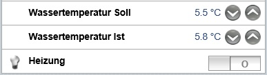

Setpoint
========

Mit Setpoint kann man in vordefinierten Schritten einen (zB virtuellen Soll-)Wert einstellen.
Diesen kann man dann in den Regeln benutzen um zB zu entscheiden, ob eine Pumpe oder Heizung anspringen soll.
Man könnte sich auch vorstellen das Öffnungsverhältnis eines Schiebers, Kugelhahns, oder Rollladens zu steuern.
In diesem Fall muss dann allerdings statt (wie in dem Beispiel) "postUpdate" ein "sendCommand" verwenden.

In der Datei <MyItemFile>.items legt man die zu definierende Variable an:
    Number Wassertemperatur_Soll_Setpoint

In der Sitemap sieht es dann so aus:
    Setpoint item=Wassertemperatur_Soll_Setpoint label="Wassertemperatur Soll [%.1f °C]" step=0.5 minValue=1 maxValue=30

Dort wird die Schrittweite (hier 0.5), sowie der minimale bzw maximale Wert und die Formatierung für die Anzeige des Textes
auf der Seite festgelegt (in diesem Fall eine Nachkommastelle mit den folgenden Zeichen für Grad Celsius).

In der Datei <MyRulesFile.rules> kann dann mit z. B. if(Wassertemperatur<Wassertemperatur_Soll_Setpoint){Heizung_Ein...}else{Heizung_Aus...}
abfragen und entsprechend handeln (ist jetzt nur ein primitives Beispiel, eigentlich würde man da einen PID-Regler-Code verwenden - z. B. Arbeit für einen Arduino,
dem man nur den Sollwert gibt und der kümmert sich dann um die Regelgeschichten um openHAB zu entlasten).
Die (virtuelle) Variable muss aber initialisiert werden wenn sie nicht durch
z. B. einen Sensorwert den Ihren erhält (durch Persistenzdienst oder wenn es nicht klappt, warum auch immer, manuell), sonst funktioniert es bei einem Neustart nicht und man hat statt einer Zahl nur ein Minuszeichen, welches man nicht ändern kann.

Setpoint Beispiel
-----------------

Das Beispiel beinhaltet auch das Auslesen eines Fließkommawertes und Setzen eines Schalterzustandes.
Man stellt hier eine Soll-Temperatur ein und simuliert eine Ist-Temperatur:

### Sitemap

    sitemap  Beispiel label="Setpoint Beispiel"
    {
        Frame label="Temperatur wählen" {
            Setpoint item=Wassertemperatur_Soll_Setpoint label="Wassertemperatur Soll [%.1f °C]" step=0.5 minValue=1 maxValue=30
            Setpoint item=Wassertemperatur_Ist_Simulation label="Wassertemperatur Ist [%.1f °C]" step=0.1 minValue=4 maxValue=7
            Switch item=Heizung_Switch label="Heizung"
            }
    }

### Items

    Number Wassertemperatur_Soll_Setpoint
    Number Wassertemperatur_Ist_Simulation
    Switch Heizung_Switch

### Rules

    rule "Init virtual Items"
    when
        System started
    then
        if (Wassertemperatur_Soll_Setpoint.state == Uninitialized) {
            Wassertemperatur_Soll_Setpoint.postUpdate(5.5) //postUpdate ist nur für Aktualisierungen innerhalb von openHAB (sendCommand gibt diese auch auf den Bus)
        }
        if (Wassertemperatur_Ist_Simulation.state == Uninitialized) {
            Wassertemperatur_Ist_Simulation.postUpdate(5.8)
        }
    end
    
    rule "Temperatur Ist mit Soll vergleichen"
        when
            Item Wassertemperatur_Ist_Simulation changed or
            Item Wassertemperatur_Soll_Setpoint changed
        then
            var double wtsp=(Wassertemperatur_Soll_Setpoint.state as DecimalType).doubleValue
            var double wtsi=(Wassertemperatur_Ist_Simulation.state as DecimalType).doubleValue
            if (wtsi < wtsp){
    //          sendCommand(Heizung_Switch, "ON") //auch gültig (findet man oft in Beispielen) aber wie folgt ist eine geeignetere objektorientierte Schreibweise
                Heizung_Switch.sendCommand(ON)
            }
            else {
    //          sendCommand(Heizung_Switch, "OFF") //auch gültig
                Heizung_Switch.sendCommand(OFF)
            }
        end
